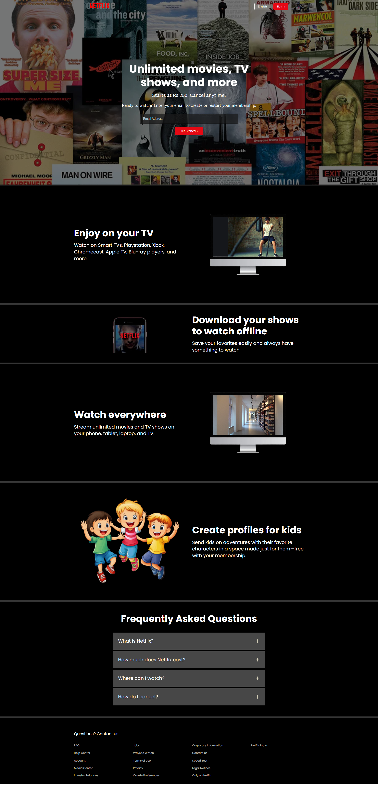

# Netflix Clone – HTML & CSS

A fully responsive Netflix landing page clone built using only **HTML** and **CSS**.  
This project replicates the look and feel of Netflix's official homepage, including the hero section, feature highlights, FAQ accordion style, and footer.  
It is intended as a front-end practice project to sharpen skills in layout, styling, and responsive design.

---

## 📸 Preview

 <!-- Replace with actual screenshot path -->

---

## 🚀 Features

- **Pixel-perfect UI** inspired by Netflix's landing page
- **Responsive design** for mobile, tablet, and desktop
- **Hero section** with call-to-action form
- **Feature showcase** with embedded videos
- **Download & watch everywhere** section
- **Kids profile** creation section
- **FAQ accordion style layout**
- **Clean, maintainable CSS structure**

---

## 🛠️ Built With

- **HTML5** – semantic structure
- **CSS3** – flexbox, grid, responsive media queries
- **Google Fonts** – *Poppins* and *Martel Sans*

---

## 📂 Folder Structure

netflix-clone-html-css/
│
├── index.html # Main HTML file
├── style.css # Stylesheet
└── Assets/
├── Images/ # All images used in the project
└── Videos/ # Demo videos displayed in TV sections


---

## 📱 Responsiveness

The layout adapts for:
- Large screens (desktop & TV)
- Tablets
- Mobile devices (portrait & landscape)

Media queries ensure optimal readability and usability at all screen sizes.

---

## 💡 How to Use

1. **Clone the repository**
   ```bash
   git clone https://github.com/fazalsphere/netflix-clone-html-css.git
